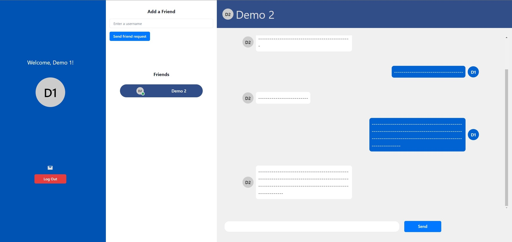

# Chat-App


## Requirements

- Redis

## Usage

```
git clone https://github.com/DavidREsc/Chat-App.git
```

Go into the project directory

```
cd Chat-App
```

Start Redis server and run the command:

```
npm start
```